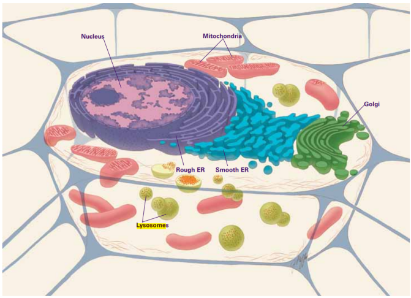
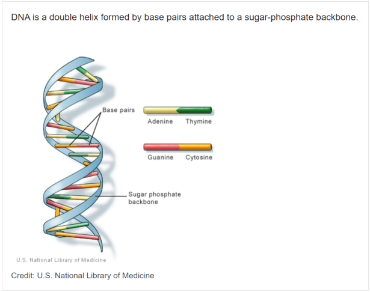
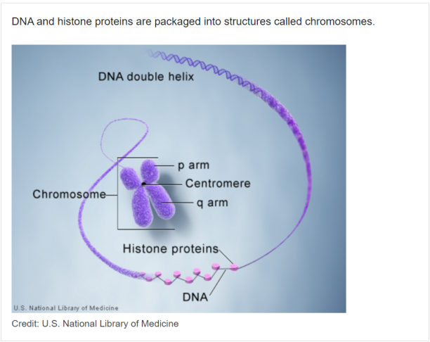
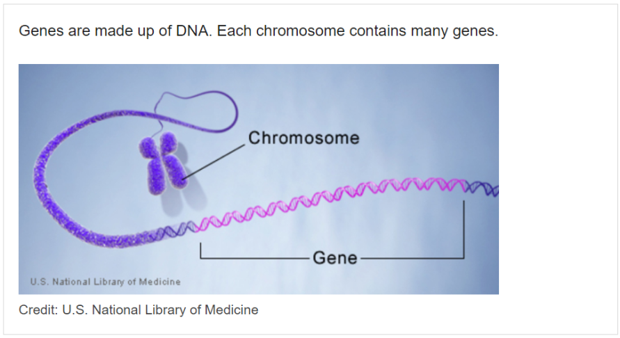
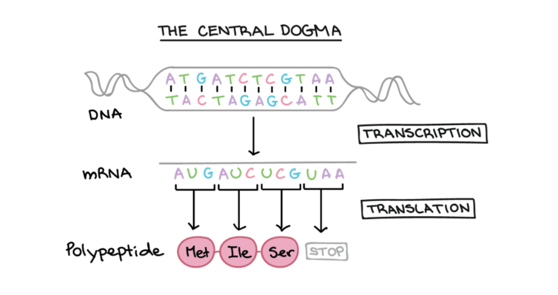

# DNA Basics

If you are a few decades removed from your high school biology class as I was when I embarked on this journey, this introduction will be a quick refresher. I'll focus on the key concepts that you need to understand to make the most of your investment. I'll point to additional resources that I found useful if you'd like to dive deeper.

## Key Topics

Our discussion will be limited to Human DNA. It helps to understand where DNA is found and so we'll start by discussing cell structure. In most other text you'll see a distinction make between cells that have a nucleus (eukaryotic) and those that don't (prokaryotic). Human cells are eukaryotic.

In order to have a good understanding of genetics, you'll need to understand key concepts like DNA, chromosomes, genes and RNA.

## Cells

Cells are the most basic elements of all living things and they have very distinct functions. Although they have different functions, human cells have certain parts that govern that function. These parts are called organelles and we'll highlight a few critical ones. The illustration below shows a a cross section of some of the key organelles.

### **Nucleus**
The Nucleus is the most prominent organelle. It's also referred to as the cell's brain. For our discussion, the Nucleus's role as the keeper of the DNA is most important. Most of the DNA that's we'll focus on is found inside the Nuceleus.

### **Mitochondria**
Mitochondria is the organelle responsible for energy production. It's also referred to as the cell's power plant. Mitochondria makes ATP (Adenosine Triphosphate), which is what powers all cells. There's a form of DNA found in the Mitochondria called Mitochondrial DNA(mtDNA) which we might touch on.

### **Lysosomes**
Lysosomes play a critical role of recycling and garbage collection. When cells are destroyed, the Lysosomes will break it up into components and reuse that it can and dump what it can't outside the cell.

## DNA

**DNA**, **D**eoxyribo**N**ucleic **A**cid is the elemental hereditary material in all living things. It's the blueprint that cells use to make making more copies of themselves as needed. For humans, most DNA is located in the cell nucleus (nuclear DNA). However a small amount of DNA is found the Mitochondria(mitochondrial DNA aka mtDNA).

DNA is composed of four bases, Adenine(A), Guanine(G), Cytosine(C) and Thymine(T). The bases are assembled together like letters in a word, sentence, paragraph without punctuation. Arranged linearly, human DNA is about 3 billion letters long. For all humans more than 98% of this code is identical. Less than 2% accounts for differences in all humans.

So, how does a 3 billion long string fit in the microscopic human cell? This is one of the amazing things about the human body. DNA bases pair up with each other, the chemical structure allows Adenine(A) to attract/attach to Thymine(T) and Cytosine(C) attracts/attaches to Guanine(G). These units are called base pairs. To aid with stability, a base pair combines with a sugar and a phosphate to form a nucleotide. Nucleuotides are arranged into the famous double helix shape depicted below.

Once this base structure has been formed, the next challenge is how to package it so it can fit in a cell. This is accomplished by tightly winding the dna around proteins called histones and them even more tighly compacting them into the general shape that's a chromosome.

## Chromosomes
Chromosomes are units of storage of DNA. A chromosome is made up of tightly packaged DNA. Human cells have two copies of 23 chromosomes, one copy inherited from your father and one copy inherited from your mother. Because humans have two copies (2 x 23 chromosomes), they are referred to as diploid. A picture of human chromosomes called a **karyotype** is used by scientist to show human chromosomes. The first 44 chromosomes are called **autosomes** and structurally are similiar for males and females. The last 2 chromosomes called the **sex chromosomes** are what determine gender. Males are born with an X and Y chromosome and females are both with 2 Xs.

## Genes
Genes are sections of your DNA that determine how the body functions. The Human Genome Project estimates that humans have between 20,000 to 25,000 genes. Some of the genes are small, a few hundred base pairs, while some are as large as 2 million bases pairs.

Because we are diploid, every person has two copies of the each gene inherited from each parent. Slight variations in genes from person to person is what determines the physical attributes, **phenotypes**, that make us unique.

## RNA
Unlike it's sexy sister, DNA, **R**ibo**N**ucleic **A**cid is less famous but is equally important in the process of cell development. Understanding the DNA/RNA relationship is critical and we'll discuss that shortly in the **Central Dogma**. At a high level, RNA is produced by your body in a process called **Transcription**. Basically you body starts with DNA and transcribes into into RNA. A few slight differences exist. While DNA is double stranded (remember the double helix), RNA is single stranded. The Thymine(T) base in DNA is replaced by Uracil(U) in RNA.

## Central Dogma
This is the central principle that explains how DNA is processed by your body to produce new cells. This process can be broken down into two phases. The first phase, **transcription** takes DNA and converts it to RNA. This process is fairly straight forward, as the string of DNA is processed each base is converted to it's equivalent RNA counterpart. Except for Thymine(T) which is transcribed to Uracil(U) all other bases are essentially copied over.

The second phase in the process takes this single strand of RNA and reads each of the bases sequentially. Each three bases called a **codon** is **translated** into an amino acid as depicted below.

Each codon maps to one of 22 amino acids. One the process is completed, the resulting chain of amino acids (polypeptide chain) is then folded into a protein which will determine the function of the cell.

## Additional Resources
coming soon...